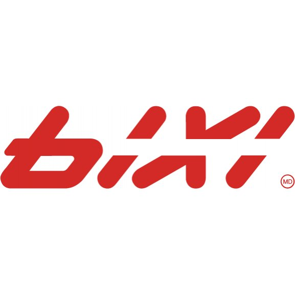

 
  

# BIXI Project

## Table of Contents
- [About the Project](#about-the-project)
- [Prerequisites](#prerequisites)
- [The Data](#the-data)

## About the Project 
This goal of this project is to analyze the data and understand Bixi bike usage, the factors that influence the volume of usage, where the popular stations are, and to assess overall trends in Bixi bike usage over time to gauge business growth and identify opportunities for improvement or expansion. This project will utilize SQL and Tableau.

## Prerequisites
- Language: SQL
- Technology: Tableau

## The Data
The data used is a cleaned version downloaded from the [open data portal at Bixi Montreal](https://www.bixi.com/en/open-data).

To load the data, run the SQL file [here](https://drive.google.com/file/d/1YcyumgSrwX4ezVLNoAZBzN1XTgKqrCZZ/view).
